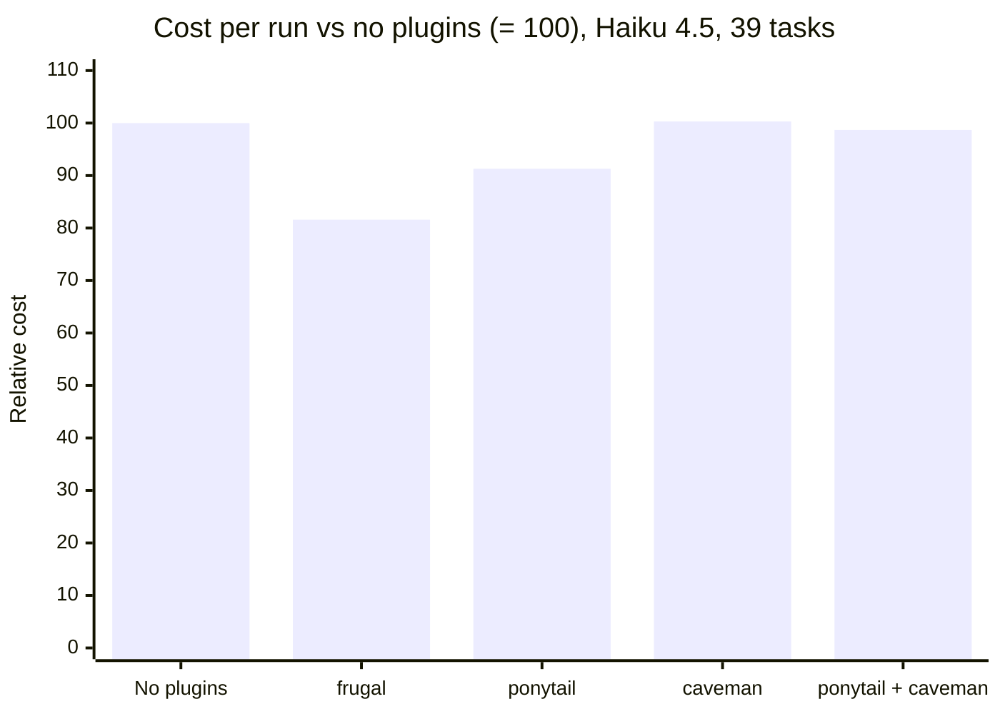

# frugal benchmarks

Full results behind the summary in the [README](README.md#benchmarks): how each test works, the current batches task by task, and every earlier batch, newest first. Arms are only compared within the same batch, because the system prompt changes between batches.

## Tests

Costs are the `total_cost_usd` Claude Code reports.

- `bench/bench.py`: fixed tasks in a temp copy of a fixture. t1 fix a bug without touching the test; t2 find the largest month-over-month drop in a CSV; t3 draft a support reply with placeholders for unknown facts; t4 a 16-message session; t5 log triage, a rate limiter from scratch, and a long explanation; t6 extract notice periods from 30 contracts into a CSV; t7 a 40-message session; t8 a risk review of the same 30 contracts; t9 a risk review of 150 contracts (~165k tokens), each with one planted risk that must be named, checked for at least 90% of vendors.
- `bench/ponytail_agentic`: ponytail's own agentic benchmark (MIT) with frugal and ponytail + caveman arms added: 39 security, reuse, root-cause, open-ended, vibe, frontend, and backend tasks, scored by its own checks. caveman and ponytail run at `full`, their default.
- `bench/caveman_eval.py`: caveman's own ten dev questions, each answered with a replaced system prompt ("Answer concisely." alone, plus caveman's `SKILL.md`, or plus frugal's), scored blind by a Sonnet judge from 0 to 3.

**How batches stay affordable.** Most of a run's cost is Claude Code's own context, not the task, so a full matrix (39 tasks, five arms, three runs, three models) would cost hundreds of dollars. Instead:

1. Fixed cost is measured once per model with `t0_ok`, a one-word task. It is deterministic, so a few warm runs give the exact overhead each plugin adds; `bench.py report` prints it against no plugins.
2. Behavior (lines of code, turns, pass rate) is measured on Haiku over all 39 tasks.
3. Sonnet and Opus confirm it on `core8`, eight tasks covering every category. Their intervals are wider, and the README shows them.
4. `--runs 2 --max-runs 3` adds a run only where cost varies more than 25% or pass and fail are mixed.
5. Arms that did not change are reused from an earlier batch (`--reuse`) only if a baseline rerun on four anchor tasks matches it within 10%; otherwise every arm reruns together. Reused cells are labeled in `results.json`.

## Current batches

### Feature work: ponytail's harness, Haiku 4.5

Five-arm batch (2026-10-04), 39 tasks, n=3, 585 cells. Relative cost is the geometric mean of the per-task cost ratio against no plugins:

| Arm | Correct | Safe | Lines (median) | USD per run | vs no plugins |
|---|---|---|---|---|---|
| No plugins | 0.949 | 0.974 | 59 | 0.0810 | 0% |
| frugal | 0.974 | 0.983 | 38 | 0.0646 | -18.4% |
| ponytail | 0.991 | 0.966 | 38 | 0.0722 | -8.7% |
| caveman | 0.949 | 0.957 | 40 | 0.0830 | +0.3% |
| ponytail + caveman | 0.966 | 0.974 | 40 | 0.0793 | -1.3% |

That batch ran before the last 0.12.2 rule (Python by default, see below). frugal 0.12.2 against ponytail, all 39 tasks (2026-10-06), n=3, 234 cells, one batch. Cost is the mean per run; "vs ponytail" is the geometric mean of the per-task cost ratio:

| Arm | Correct | Safe | Lines (median) | USD per run | vs ponytail |
|---|---|---|---|---|---|
| frugal | 1.000 | 0.991 | 29 | 0.0512 | -13.2% (90% CI -19.6% to -6.8%) |
| ponytail | 0.983 | 0.974 | 30 | 0.0614 | 0% |

frugal passed every correctness check. Its one miss was a safety check on trace-transfer (1 of 3 runs patched `transfer` but not the shared debit that `withdraw` also uses); ponytail missed it in 3 of 3.

What changed in 0.12.2, each tested against the previous rules in its own batch on Haiku:

- With no shell, frugal sometimes spawned a subagent only to run a test, and sometimes left requested code in the scratchpad or only in the reply. `SKILL.md` now says requested code goes in a file in the working directory and that a check is never run by a subagent, and the worker's description excludes it. Both rules together, on the 12 tasks where frugal had failed (n=3): correct 0.806 to 0.944, runs with a subagent 7 of 36 to 1 of 36, cost -14.7%.
- A new script with no language named and no project files is Python with the stdlib. frugal had written JavaScript with npm packages for "build me a web scraper", which the harness scores as no file: 4 of 4 correct instead of 2 of 4, at 0.034 instead of 0.078 USD per run; the frontend control task was unchanged.

### Feature work: ponytail's harness, Sonnet 5.5

Five-arm batch (2026-10-07, frugal 0.12.2), 39 tasks, n=3, 585 cells, no cell failed to run. The first 234 cells (frugal and ponytail) and the other 351 were run in two passes of the same run directory, minutes apart. Relative cost is the geometric mean of the per-task cost ratio against no plugins:

| Arm | Correct | Safe | Lines (median) | USD per run | vs no plugins |
|---|---|---|---|---|---|
| No plugins | 1.000 | 1.000 | 71 | 0.0953 | 0% |
| frugal | 1.000 | 1.000 | 38 | 0.0823 | -12.2% (90% CI -16.8% to -7.6%) |
| ponytail | 1.000 | 1.000 | 27 | 0.0853 | -8.7% (-13.5% to -3.6%) |
| caveman | 1.000 | 1.000 | 77 | 0.1131 | +20.3% (+16.3% to +24.0%) |
| ponytail + caveman | 1.000 | 1.000 | 33 | 0.1017 | +10.3% (+4.1% to +16.8%) |

Lines are the median of code lines (comments excluded), as in the other tables. Every arm passed every check, so on Sonnet the comparison is cost and size only. caveman costs more than no plugins here and leaves the code about the same size.

### Feature work: ponytail's harness, Opus 5.5

Five-arm batch (2026-10-07 to 08, frugal 0.12.2), n=3. 34 of 39 tasks finished in every arm (510 cells); the rest stopped at the usage limit and are not counted. Lines are the median of code lines (comments excluded), as in the other tables. Relative cost is the geometric mean of the per-task cost ratio against no plugins, with a 90% bootstrap interval over tasks:

| Arm | Correct | Safe | Lines (median) | USD per run | vs no plugins |
|---|---|---|---|---|---|
| No plugins | 0.980 | 0.980 | 151 | 0.2842 | 0% |
| frugal | 0.990 | 0.990 | 40.5 | 0.1515 | -39.0% (-46.8% to -30.2%) |
| ponytail | 0.990 | 1.000 | 34 | 0.1596 | -36.0% (-44.5% to -26.1%) |
| caveman | 0.990 | 0.990 | 124 | 0.2959 | +8.1% (+2.0% to +14.4%) |
| ponytail + caveman | 0.941 | 0.980 | 41 | 0.1870 | -23.9% (-34.1% to -12.1%) |

Opus without plugins over-builds most (151 lines), so both minimal-code rule sets save the most here. frugal and ponytail are within each other's intervals; ponytail + caveman fails more correctness checks than either alone.

### Fixes, analysis, and heavy tasks: Opus 5.5

frugal 0.12, six tasks of `bench.py` (2026-10-03), median cost per run in USD, n=3. Every run passed every check.

| Task | No plugins | frugal | Difference | Output tokens |
|---|---|---|---|---|
| t1 bug fix | 0.135 | 0.157 | +16% | 608 to 724 |
| t2 CSV question | 0.127 | 0.134 | +6% | 632 to 566 |
| t3 support reply | 0.137 | 0.147 | +7% | 1,145 to 1,125 |
| t5 heavy | 0.347 | 0.287 | -17% | 5,946 to 4,134 |
| t6 30 contracts | 0.232 | 0.221 | -5% | 1,994 to 1,855 |
| t8 risk review | 0.398 | 0.432 | +9% | 5,700 to 5,895 |
| **Sum** | **1.376** | **1.378** | **0%** | **16.0k to 14.3k (-11%)** |

t1 cost more because this batch made every code task read `code.md`. That rule now applies on Opus and Fable only past 3 tool calls; a t1 rerun of 3 runs each came out 0.136 to 0.145 (+7%), with fewer output tokens. t4, t7, and t9 were not rerun.

### Plain questions: caveman's eval, Opus 5.5

caveman's own ten dev questions (`evals/prompts/en.txt`), each answered with a replaced system prompt: "Answer concisely." alone, plus caveman's `SKILL.md`, or plus frugal's. n=20 answers per arm; a Sonnet judge scored each answer blind, 0 to 3.

| Arm | Median output tokens | Mean output tokens | Mean cost per answer | Judge score |
|---|---|---|---|---|
| "Answer concisely." | 560 | 605 | 0.0172 | 2.95 |
| caveman | 514 | 483 | 0.0159 | 3.00 |
| frugal 0.12 | 488 | 524 | 0.0158 | 2.95 |

A tie on caveman's ground: lower median, higher mean, same cost, same quality (one answer at 2 in each of the control and frugal arms). Script: `bench/caveman_eval.py`.

frugal's visible answers were already the shortest (922 to 1,024 characters against caveman's 1,184 to 1,230); its output tokens were not, because Opus counts its thinking as output and frugal's rules made it weigh more before answering (roughly 250 hidden tokens per answer against caveman's 155, estimated as output tokens minus characters / 3.6). Two variants in one batch, n=20 each: removing the rules that ask for a decision on every task cut output 20%; a first line that sends plain questions straight to an answer, with only the reply and exactness rules applying, cut it 33%. 0.12.1 ships that line. Rerun against caveman (2026-10-03, n=20 each):

| Arm | Median output tokens | Mean output tokens | Mean characters | Judge score |
|---|---|---|---|---|
| caveman | 504 | 493 | 1,196 | 3.00 |
| frugal 0.12.1 | 278 | 354 | 922 | 3.00 |

**Fixed cost.** A one-word task (`t0_ok`, "Reply with only the word ok", Opus, n=8) measures what having frugal on costs before it saves anything: the plugin enabled adds ~330 input tokens (skill and agent descriptions), `/frugal` adds ~1,140 in all. Claude Code writes them to the prompt cache once per session, about 0.009 USD on Opus. On a 3-call task that is the whole difference: 0.12.1 vs no plugins, n=4, t1 bug fix +1%, t2 CSV question +8%, t3 support reply +4%, all passed. Tasks that short have too little output to pay the fixed cost back; longer ones do.

### How this relates to the published numbers

- **caveman** reports 65% fewer output tokens on single API calls against a model with no system prompt, whose average reply was 1,214 tokens. Its README notes that the rules cost 1 to 1.5k input tokens per turn and that already-terse workloads can lose money.
- **ponytail** reports 54% fewer lines of code and 20% lower cost on 12 feature tasks in its harness, with Haiku 4.5 and n=4. Our 39-task batch with Haiku 4.5 found ponytail 8.7% cheaper than no plugins, with 36% fewer lines of code (median 38 against 59).

## History

### frugal 0.12: ponytail's harness, Haiku 4.5

First batch, nine tasks (security, reuse, root cause, open-ended, vibe, frontend, backend), n=2, every cell correct:

| Arm | Cost, sum of task means | Lines of code, sum | Over-engineering (judge, 0 to 3) |
|---|---|---|---|
| No plugins | 0.660 | 1,016 | 0.56 |
| frugal | 0.602 | 556 | 0.33 |
| ponytail | 0.615 | 384 | 0.28 |

frugal lost on the frontend: Haiku built a calendar instead of the native date input, and added demo files. 0.12 then named the native elements in `code.md` (`<input type="date">`, `type="color"`, `<dialog>`, `
`), made code tasks read the code rules, and put the root-cause rule in the core. Rerun of the four weakest tasks, same batch for both arms, n=2:

| Task | frugal USD | ponytail USD | frugal lines | ponytail lines |
|---|---|---|---|---|
| Date picker | 0.083 | 0.102 | 37 | 80 |
| Color picker | 0.061 | 0.130 | 22 | 226 |
| Mandelbrot | 0.037 | 0.065 | 33 | 61 |
| trace-transfer | 0.028 | 0.039 | 17 | 17 |
| **Over-engineering (judge)** | **0.00** | **1.25** | | |

ponytail's color picker ranged from 68 to 226 lines between the two batches: at n=2 single tasks swing a lot. The harness checks root-cause fixes on trace-transfer (the bug report names `transfer`, the shared `_debit` also breaks `withdraw`): after the core rule, frugal fixed the shared cause in 4 of 7 runs across three batches, ponytail in 1 of 6. The judge is the harness's own `judge.py` (Sonnet, validated by its selftest), run through `claude -p` when no API key is set; on template tasks it reads the agent's diff instead of the whole repo.

### frugal 0.11, Opus 5.5

One batch (2026-10-02), median cost per run in USD, n=4 (t7 and t9 n=2). Every run passed every check.

| Task | No plugins | frugal | Difference | Output tokens |
|---|---|---|---|---|
| t1 bug fix | 0.134 | 0.130 | -4% | 620 to 412 |
| t2 CSV question | 0.126 | 0.134 | +6% | 483 to 594 |
| t3 support reply | 0.139 | 0.143 | +3% | 1,222 to 1,002 |
| t4 16 messages | 0.626 | 0.613 | -2% | 8,807 to 7,554 |
| t5 heavy | 0.322 | 0.284 | -12% | 5,308 to 3,776 |
| t6 30 contracts | 0.225 | 0.259 | +15% | 1,920 to 1,972 |
| t7 40 messages | 1.498 | 1.316 | -12% | 19,788 to 15,884 |
| t8 risk review | 0.384 | 0.345 | -10% | 5,696 to 4,736 |
| t9 150 contracts | 0.325 | 0.336 | +4% | 5,223 to 4,712 |
| **Sum** | **3.779** | **3.560** | **-6%** | **49.1k to 40.6k (-17%)** |

Single tasks move a lot between batches at n=4: t6 ranged from -12% to +29% across six batches, and t8 from -18% to +13% across four. The sum is the number to trust.

### frugal 0.11: ponytail's harness, Haiku 4.5

`bench/ponytail_agentic` is ponytail's own agentic benchmark (MIT) with a frugal arm added: feature tasks in a FastAPI + React template, scored by its own checks. caveman and ponytail ran at `full`, their default. Same batch as the 0.11 Opus run above, mean cost per run, n=4:

| Task | No plugins | frugal | ponytail | caveman |
|---|---|---|---|---|
| Date picker, USD | 0.141 | 0.129 (-8%) | **0.116 (-18%)** | 0.197 (+40%) |
| Date picker, lines of code | 461 | 234 | **102** | 393 |
| Search endpoint, USD | 0.100 | 0.106 (+6%) | 0.104 (+4%) | 0.124 (+24%) |
| Search endpoint, lines of code | 46 | 45 | 41 | 46 |

Every cell passed. On the date picker the cost follows one design decision per run: in this batch frugal used the browser's native date input once in 21 lines, wrapped it in 320 lines once, and built a calendar component twice (211 and 256 lines). Across five batches while frugal's rules changed, frugal ranged from -8% to -57% on the date picker and ponytail from -18% to -58%; on the search endpoint every arm writes the same ~44 lines, so no rule set has anything to save and results swing from -20% to +35%.

One earlier 0.11 batch was stopped: a frugal run asked "standalone component or inside a form?" instead of building, and in a headless run nobody answers. 0.11 now builds the simplest option and names the alternative in one line.

### Earlier versions, Opus 5.5 and Sonnet 5.5

frugal 0.5, n=2, mean cost per run in USD. caveman and ponytail ran at `ultra`, their strongest level.

| Arm (Opus 5.5, batch 2) | t1 | t2 | t3 | t4 | t5 | Sum | vs no plugins | Output tokens per rep |
|---|---|---|---|---|---|---|---|---|
| Claude Code, no plugins | 0.133 | 0.129 | 0.144 | 0.669 | 0.323 | 1.398 | | 16.9k |
| caveman ultra + ponytail ultra | 0.187 | 0.182 | 0.196 | 0.733 | 0.384 | 1.681 | +20% | 15.4k |
| frugal 0.5 | 0.153 | 0.153 | 0.152 | 0.649 | 0.280 | 1.387 | -1% | 13.9k (-18%) |

| Arm (Sonnet 5.5, batch 3) | t1 | t2 | t3 | t4 | t5 | Sum | vs no plugins | Output tokens per rep |
|---|---|---|---|---|---|---|---|---|
| Claude Code, no plugins | 0.083 | 0.072 | 0.078 | 0.447 | 0.185 | 0.865 | | 13.0k |
| frugal 0.5 | 0.092 | 0.087 | 0.086 | 0.441 | 0.176 | 0.883 | +2% | 11.1k (-15%) |

caveman and ponytail separately (Opus 5.5, batch 1, frugal 0.3.3; t1 uses only the second run of each arm, because the first run of a batch pays for writing the system prompt cache):

| Arm | t1 | t2 | t3 | t4 | t5 | Sum | vs no plugins | First-call context |
|---|---|---|---|---|---|---|---|---|
| Claude Code, no plugins | 0.144 | 0.132 | 0.145 | 0.635 | 0.295 | 1.351 | | 38.7k |
| caveman ultra | 0.171 | 0.166 | 0.171 | 0.698 | 0.324 | 1.530 | +13% | 42.4k |
| ponytail ultra | 0.165 | 0.162 | 0.164 | 0.708 | 0.350 | 1.549 | +15% | 41.6k |
| caveman ultra + ponytail ultra | 0.181 | 0.184 | 0.203 | 0.729 | 0.360 | 1.657 | +23% | 45.3k |
| frugal 0.3.3 | 0.149 | 0.141 | 0.147 | 0.641 | 0.302 | 1.380 | +2% | 39.7k |

### What the earlier numbers say

- Input dominates: a one-message task reads 100k to 160k input tokens and writes 450 to 1,200. Opus and Sonnet in Claude Code already answer briefly, so cutting output alone saves little; loading fewer rules matters as much.
- caveman and ponytail add 3k to 7k tokens to every call in Claude Code. On fixes, analysis, and writing with Opus that cost 13 to 23% more than no plugins. On feature work with Haiku, where the model over-builds, ponytail pays for itself.
- Rules loaded on every call are the main cost on short tasks. 0.7 loaded ~1k tokens of rules on every task and cost 4 to 11% more than no plugins on one-message tasks (enabling the plugin alone adds ~0.3k). From 0.8 on, short tasks load only the small core: +0 to 3%.
- Delegation, forced with `/frugal delegate` on t5, t6, and t8: in 0.6, three haiku scouts cost 1.6 to 2.3 times plain Claude Code at the same quality. The haiku agents were cheap (0.14 to 0.22 USD); the main thread re-read the material to verify and woke up for each background agent. From 0.7 on, frugal delegated in 2 of 8 runs instead of 4, at 0.45 to 0.55 USD instead of 0.51 to 0.84.
- t9 was built to show delegation paying off at ~165k tokens. It did not get there: every arm, including the one forced to load `delegate`, found the planted clauses with a script instead of reading all 150 contracts, and none delegated. Opus scripts its way through regular documents; delegation pays off only on material a script cannot shortcut, which synthetic fixtures do not provide. The delegation rules are therefore checked for not wasting tokens, not yet for saving them.
- The 10th-message trigger was unreliable while it lived in the skill: the model loaded the session rules in 1 of 6 forty-message runs. With the hook it loaded them in all 6 long-session runs of the final batch (t4 and t7).

### Experiment: a `tight` profile (discarded)

0.4 shipped an opt-in `tight` profile to test whether cutting output harder than the default would lower total cost. It replaced the reply rules with `Done.` confirmations, bare answers, no headings or tables, short reasoning, and the fewest calls, while keeping exact values, warnings, deliverables, and tests.

It did not work. On Opus 5.5 in batch 2 it cost 1.425 USD (+2% vs no plugins) against 1.387 for the default profile, and wrote about the same output (13.7k vs 13.9k tokens per rep). The model loaded the profile in only 4 of 10 runs even after the rule was made mandatory, and one t4 run made 29 tool calls instead of 17. What output is left is deliverables (code, emails, explanations), which frugal never shortens, and reasoning, which a skill cannot limit (`/effort low` does that). 0.5 removed `tight`.
