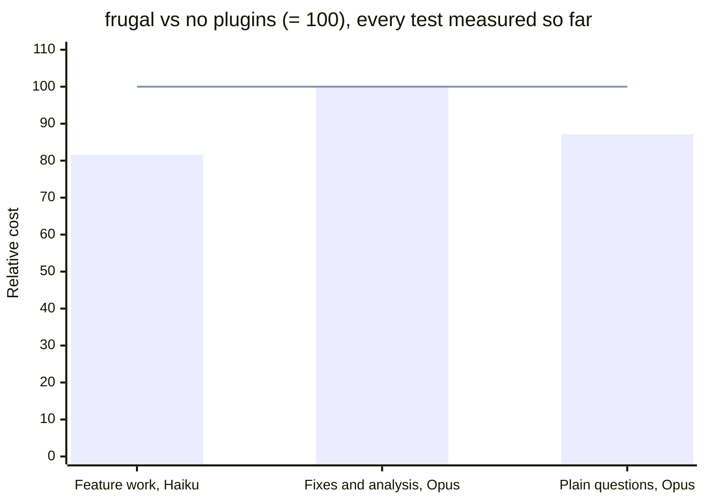

# frugal

A low-token working mode for Claude Code. Type `/frugal` and it stays on for the rest of the session.

frugal is built around one fact about agent sessions: most of the bill is input, not output. Every call re-reads the system prompt, the history, and every file and tool result in context. Shorter replies help a little; keeping the context small and making fewer calls helps much more.

## What it does

`/frugal` loads a 2.3KB core. A short task (3 tool calls or fewer) needs nothing else. Longer tasks read more rules by path, only the ones they need:

| Part | Loaded | What it does |
|---|---|---|
| `SKILL.md` | on `/frugal` | Terse replies that report results, not process; exact terms, numbers, and negations; verify APIs and versions instead of guessing; a few always-on code rules; opt-in humanizer |
| `core.md` | tasks over 3 tool calls, the 10th message, or any module named after `/frugal` | Batched tool calls, no re-reading unchanged files, questions only when the answer changes the result, module picking |
| `code.md` | with `core.md`, when the task writes, fixes, or reviews code | Minimal code: does it need to exist, reuse what the codebase has, stdlib and native platform features before dependencies, root-cause fixes, one runnable check for non-trivial logic. Refactors, migrations, verify-only tasks, and commit messages in one line each. Never cuts validation, security, accessibility, or error handling that prevents data loss |
| `modules/analysis.md` | data, research, metrics, reports | Finding first; every number with a source or derivation and units; missing data, low confidence, and inferences labeled |
| `modules/delegate.md` | raw material too big to read directly (roughly 100k+ tokens), or independent heavy parts | Hands reading to `haiku` and bounded edits to `sonnet`, never above the session model; escalates a part only when it fails |
| `modules/session.md` | the 10th message (then every 15th, from a hook), a compaction, a new unrelated task, or a model or effort that does not fit the task | Says which model and effort fit, with a ready-to-paste prompt per task, and a handoff block for a fresh chat |
| `modules/review.md` | reviews, audits, shortcut lists | Diff review with bugs and over-engineering in one pass, one line per finding; whole-repo audit ranked by lines saved; a ledger of `frugal:` shortcut comments |
| `modules/compress.md` | on request | Rewrites CLAUDE.md or another memory file to fewer bytes with a backup, keeping every instruction; saved on every call after |
| `scripts/usage.sh` | before a handoff in the CLI, or when you ask about usage | Context size and token totals from the session transcript, where `get_usage` is not available |
| `modules/agents.md` | pipelines, subagent prompts, machine-read output | Structured, parseable output; no narration; never invents paths, endpoints, or field names |
| `hooks/session-count.sh` | every prompt, prints nothing until the 10th | Counts messages per session and, when `/frugal` is active, tells the model to read `core.md` and `session.md` at the 10th message and every 15th after. A skill cannot count messages reliably; the hook can. Needs `sh` (Git Bash on Windows) |
| `humanizer` | only if you say yes | Rewrites AI-sounding text. Based on [blader/humanizer](https://github.com/blader/humanizer), MIT |

The read instruction is the first line of the core and names both files at once. Haiku skipped a chain of reads ("read core, then the module it points to") in every run, and follows a single direct instruction in every run. You can force modules yourself: `/frugal analysis coding`.

**Cheaper models without settings.** The plugin ships two subagents, `frugal-scout` (read-only search and extraction) and `frugal-worker` (bounded edits). The `delegate` module passes the model on every call, so nothing in your settings changes:

| Session model | Search, read, extract | Bounded edits |
|---|---|---|
| Fable | haiku | sonnet |
| Opus | haiku | sonnet |
| Sonnet | haiku | sonnet |
| Haiku | haiku | haiku |

It delegates only when the raw material is too big to read directly, or more than ~30k tokens in a session that continues for many turns. Each subagent starts with an empty cache, and in the bench reading 30 contracts (~32k tokens) directly cost less than splitting them across three subagents. Once it delegates, the main thread does not redo the work: it spot-checks at most two results, or all of them when an error would touch money, security, legal terms, or unrecoverable data. A part that fails is re-run one model up (`haiku` to `sonnet`), and only that part.

**Humanizer is opt-in.** The first time frugal is about to write text for people (a customer email, a ticket reply, docs, a post), it asks once: Yes, No, Always this session, or Never this session. It never runs for code, commits, or internal notes.

frugal covers what caveman and ponytail do, so you do not need them. If they are enabled, disable them: their rules are added to every call (see [Benchmarks](#benchmarks)).

## Install

### Let your agent install it

Paste this into Claude Code (CLI, desktop, or IDE), Claude Cowork, Codex, Cursor, or any agent that can run shell commands:

```text
Install the frugal plugin from https://github.com/CroaBeast/frugal for me.

1. If you are Claude Code: run `claude plugin marketplace add CroaBeast/frugal`, then `claude plugin install frugal@frugal`. Tell me to start a new session and type /frugal.
2. Otherwise, if you support Agent Skills (folders containing a SKILL.md): clone the repo to a temporary folder and copy every folder under skills/ into your user skills directory. Tell me how to invoke the frugal skill.
3. Otherwise: add the text of skills/frugal/SKILL.md without its front matter, then skills/frugal/core.md and skills/frugal/code.md, to your persistent instructions file (for example AGENTS.md) and tell me which file you changed.

Change nothing else. If the caveman or ponytail plugins are enabled, tell me, but do not disable them yourself.
```

Outside Claude Code, the subagents (`frugal-scout`, `frugal-worker`) and the model routing in `modules/delegate.md` do not apply, and step 3 installs only the core rules.

### By hand, in Claude Code

```
/plugin marketplace add CroaBeast/frugal
/plugin install frugal@frugal
```

Open a new session and type `/frugal`. If you also have a separate copy of `humanizer` or of the frugal skills in `~/.claude/skills`, remove it so they do not show up twice.

## Usage

```
/frugal                   # modules picked per task
/frugal analysis          # force a module
/frugal coding agents     # several modules
```

Say `normal mode` to turn it off.

## Should you use it?

On Opus 5.5 (0.12, six tasks) frugal came out even on cost with 11% less output; on feature work with Haiku 4.5 (39 tasks) it cost 18% less than plain Claude Code and passed more checks:

- **Long sessions and heavy tasks:** in 0.11, 10 to 12% cheaper on the 40-message session, the heavy coding task, and the contract risk review. Every call re-reads the whole history, so shorter replies and fewer re-reads compound as a session grows. The 16-message session came out -2%: at the 10th message frugal writes a handoff block for a fresh chat, which only pays back when you actually move to one (see [BENCHMARKS.md](BENCHMARKS.md)).
- **Short one-off tasks:** +1 to +8% on Opus. Turning frugal on costs ~1,140 input tokens once per session (about 0.009 USD on Opus), and a 3-call task has too little output to win that back.
- **Writing features:** on ponytail's own harness (Haiku 4.5, 39 tasks, n=3), 0.12.2 passed every correctness check, cost 13% less than ponytail, and wrote slightly less code in the same batch (see below).
- **Plain questions:** on caveman's own eval, 0.12.1 answered with 28 to 45% fewer output tokens than caveman at the same judged quality.
- **Behavior, not just tokens:** verify APIs and versions instead of guessing, build the sensible default instead of stopping to ask, minimal code that keeps validation and tests, opt-in humanizer for text people read.

**Questions cost tokens too.** Each question is one extra call: the model writes the question, your answer comes back, and the whole context is read again (mostly from cache, which is cheaper). That is why frugal asks only when missing information would change the result: one question is much cheaper than redoing work built on a wrong guess.

## Model routing and other tools

A skill cannot switch the session's model or effort. frugal routes its subagents, and when a task fits another model: a bounded task goes to a subagent on the cheaper model automatically; open-ended work, or work that needs a stronger model than the session, gets a prompt to paste in a new chat with the model and effort to use. Small tasks it does in place, since a new chat re-pays the system prompt. Beyond that, Claude Code has its own controls, and they combine with frugal:

| Option | What it routes | Notes |
|---|---|---|
| `/model opusplan` | Opus while planning, Sonnet while executing | Switches at the plan-mode boundary, not per request |
| `/effort low` to `max` | How much the model thinks per step | Set it per session; `low` for simple work |
| `CLAUDE_CODE_SUBAGENT_MODEL` | Default model for subagents | frugal passes the model explicitly anyway |
| A proxy such as claude-code-router or OmniRoute | Every request, by rules or cost | Needs provider API keys and routes to non-Anthropic models, so the quality claim above no longer holds |

Switching models inside one session also throws away the prompt cache, which is per model: the next call re-pays the whole context at the uncached rate. That is why per-request routing pays off in your own app with independent requests, and much less inside one long agent session.

Knowledge-graph tools such as Graphify target a different cost (exploring very large repos) and are not measured here.

## Benchmarks

Every number here comes from real headless Claude Code sessions (`claude -p`), checked automatically, with every arm run in the same batch, and losses are shown next to wins. caveman and ponytail publish numbers from their own setups: caveman from single API calls against a model with no system prompt, ponytail from feature tasks on Haiku only. Here each plugin runs the way you would use it, on three tests and three models. Per-task tables, methods, and every earlier batch are in [BENCHMARKS.md](BENCHMARKS.md).



Bars are frugal, the line is no plugins. The chart covers only what has been measured; the table below shows every plugin and the combinations not run yet.

### Summary: every arm, every model


Cost relative to the baseline of the same batch (= 100; lower is cheaper). Each row is one batch, so compare across a row, not down a column. Pass rates and per-task results are in [BENCHMARKS.md](BENCHMARKS.md). "Not run" means that combination has no batch with the current versions yet.

| Test | Model | No plugins | frugal | caveman | ponytail | ponytail + caveman |
|---|---|---|---|---|---|---|
| Feature work (ponytail's harness, 39 tasks) | Haiku 4.5 | 100 | **81.6** | 100.3 | 91.3 | 98.7 |
| | Sonnet 5.5 | not run | not run | not run | not run | not run |
| | Opus 5.5 | not run | not run | not run | not run | not run |
| Fixes, analysis, writing (`bench.py`, six tasks) | Haiku 4.5 | not run | not run | not run | not run | not run |
| | Sonnet 5.5 | not run | not run | not run | not run | not run |
| | Opus 5.5 | 100 | 100.1 | not run | not run | not run |
| Plain questions (caveman's eval, median output tokens) | Haiku 4.5 | not run | not run | not run | | |
| | Sonnet 5.5 | not run | not run | not run | | |
| | Opus 5.5 | 100 | **87.1** | 91.8 | | |

Batches: feature work 2026-10-04 (frugal 0.12.2 before its last rule); `bench.py` 2026-10-03 (frugal 0.12); caveman's eval 2026-10-03 (frugal 0.12, baseline "Answer concisely."; caveman's eval has no ponytail arm).

**Where frugal loses.** On `bench.py` with Opus, one-step tasks cost 6 to 16% more than no plugins (1 to 8% in a 0.12.1 rerun): turning frugal on adds a fixed ~1,140 input tokens that a 3-call task cannot win back. Longer tasks pay it back, and the six-task sum comes out even. Sonnet has no batch with the current version.

**Latest head-to-head.** frugal 0.12.2 against ponytail on ponytail's own harness (Haiku 4.5, 39 tasks, n=3, 2026-10-06): every correctness check passed (ponytail 0.983), safety 0.991 against 0.974, and 13.2% cheaper (90% CI 6.8 to 19.6%).

### Reproduce

```
cd bench
python bench.py run --conds AE --reps 4 --out results      # A: no plugins, E: /frugal
python bench.py run --conds AE --tasks t1_bug,t4_long --out results
python bench.py report --out results

cd ponytail_agentic
FRUGAL_PLUGIN_DIR=<path to this repo> python run.py --all --arms baseline,frugal,ponytail,caveman,ponytail+caveman --models haiku --runs 3
python run.py ... --resume <run dir>      # finish a batch cut by a usage limit
```

`bench.py run` skips runs that already have results, and does not save runs that hit the `claude -p` session limit, so re-running the same command fills the gaps. The system prompt changes between days (org skills, connector notices), so compare arms from the same batch, and discard the first run of a batch when it pays for writing the cache.
## Versions

- **0.12.2**: requested code goes in a file in the working directory; a check is never run by a subagent; a new script with no language named is Python with the stdlib. On ponytail's harness (Haiku 4.5, 39 tasks) it passed every correctness check and cost 13% less than ponytail.
- **0.12.1**: plain questions go straight to an answer, which cut Opus's output on caveman's eval by a third; `t0_ok` measures the fixed cost.
- **0.12.0**: suggests the model and effort that fit each task (a subagent for bounded work, a prompt for a new chat otherwise); Fable in the delegation table; `review` and `compress` modules; usage totals in the CLI; code rules for the worker subagent and for every code task on Haiku and Sonnet; native UI elements named; root-cause rule in the core; the session hook ignores background-task notifications.
- **0.11.0**: a hook loads the session rules at the 10th message; frugal builds the default instead of stopping to ask. Benchmarked 6% cheaper than plain Claude Code on Opus 5.5 with 17% less output and the same pass rate.
- **0.10.0**: code rules in `code.md`, read with `core.md` only for code tasks.
- **0.9.0**: one direct read instruction first in the core (Haiku follows it); always-on code essentials; delegated parts verified by risk and escalated only on failure.
- **0.8.0, 0.8.1**: small always-on core; `core.md` and modules only for tasks over 3 tool calls or from the 10th message.
- **0.7.0**: delegation only for large inputs, never redone after delegating.
- **0.6.0**: always-on AI-tell rule; humanizer patterns 26 to 30 and a scoring step.
- **0.5.0, 0.5.1**: `tight` removed; modules read by path instead of listed as skills.
- **0.4.0 to 0.4.2**: first plugin build: per-task modules, delegation to haiku and sonnet subagents, session handoff, experimental `tight` profile.
- **0.3.0 to 0.3.3**: modular skills, standalone (no caveman or ponytail needed), opt-in humanizer.
- **0.2.0**: light and heavy work triaged per message; coding and analysis profiles dropped.
- **0.1.0, 0.1.1**: single skill on top of caveman and ponytail at `ultra`, with task profiles; the most expensive setup in the benchmarks.

## Licenses

frugal is MIT (see `LICENSE`). `humanizer` keeps its own MIT `LICENSE` file in its folder. `bench/ponytail_agentic` is ponytail's benchmark, MIT (see `LICENSE.ponytail`).
